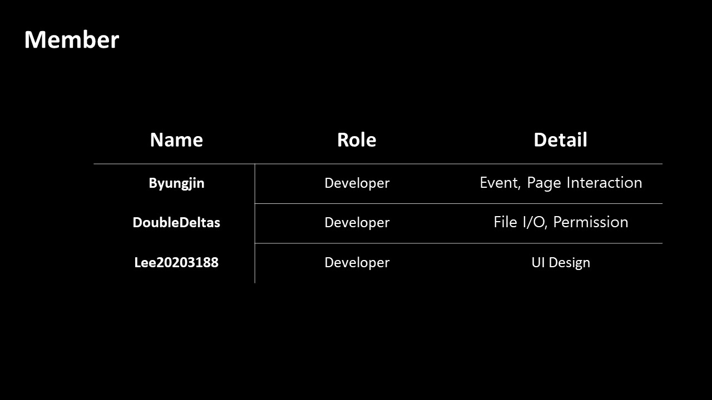
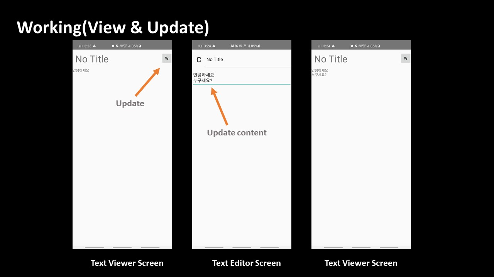
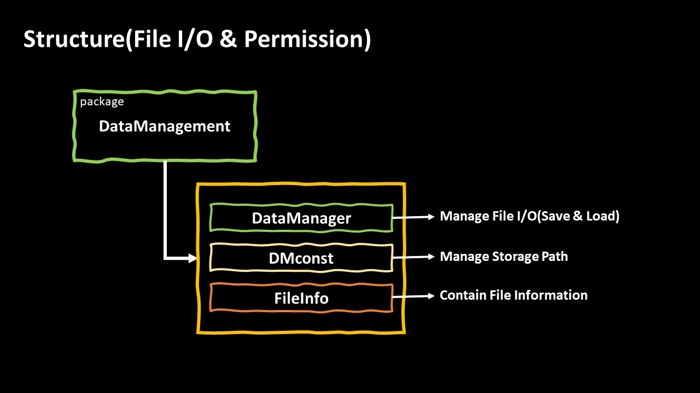
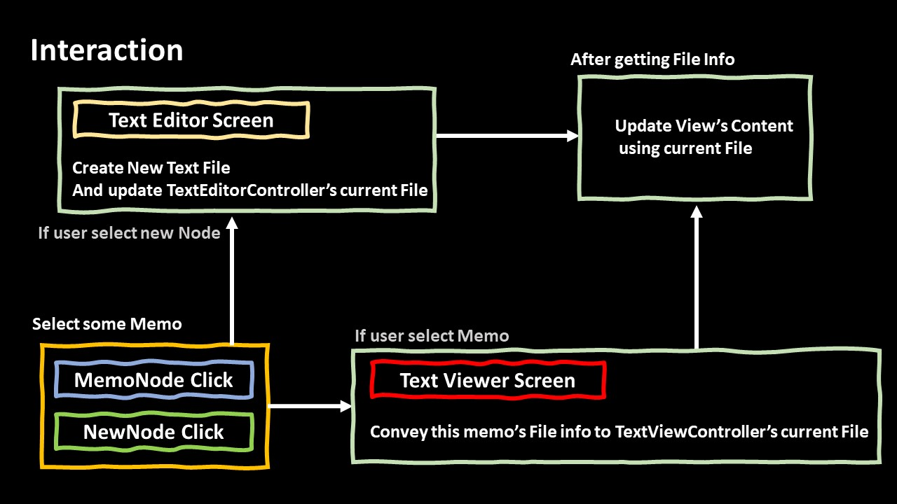

Notepad--
===
Summary
---
+ Team
    +   Byungjin.dev@gmail.com - Leader
    +   DoubleDeltas
   
+ Purpose
    +   Learn Android Application(with Java)
    +   How to make Android Application
   
+ Schedule(21-05-04 ~ 21-05-26)
    +   Week 1(04 ~ 11)
        +   Learn about Android Studio
        +   Design Application
    +   Week 2(12 ~ 18)
        +   Start Develop
    +   Week 3(19 ~ 25)
        +   Develop and Finish
        +   Prepare Presentation(About Project)
    +   Day(26)
        +   Presentation
        +   Finish Project

Presentation
---

   

   

   

   

   

   

   

   

   

   

   

   

   

   

   

   

   

   

   

   

   

   

   
Branch
---
+   master
    + Onwer : Byungjin.dev@gamil.com
    + Warning
        + Don't use this branch without meeting!!
        + Please Check Everthing before 'Push'!!
   
+   Study 
    +   byungjin
        + Owner : Byungjin.dev@gmail.com          
    +   doubledelta
        + Owner : DoubleDeltas       
     
+ Work   
    +   work_byungjin
        + Owner : Byungjin.dev@gmail.com
        + Part : Front Event, Page Interaction
        + me.byungjin.*   
    +   work_doubledelta
        + Owner : DoubleDeltas
        + Part : File I/O, Permission
   
Detail
---
+   master : 1.0.0
    +   upload - README.md
        +   Summary
        +   Branch
        +   Detail
   
+ master : 1.0.11
    +   upload - README.md
        +   change content
+ master : 1.0.2
    +   updated - README.md
+ master : 1.1.0
    +   merged - work_byungjin
+ master : 1.1.1
    +   updated - presentation